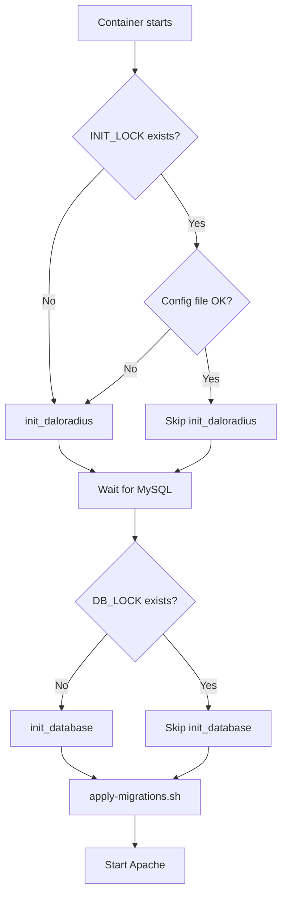

# daloRADIUS Docker — Init System

This document describes the init system for the daloRADIUS Docker container (`docker/daloradius/`).

## Architecture

The init system is split into two concerns:

```
docker/daloradius/
├── Dockerfile                  ← Builds the daloRADIUS web container
├── init-daloradius.sh          ← Entrypoint — runs every container start
├── apply-migrations.sh         ← Standalone migration runner
└── migrations/                 ← SQL evolution scripts (applied on every start if not yet run)
    ├── README.md
    └── 001-vlan-vendor.sql
```

### Two execution layers

| Layer | Script | When it runs | What it does | Idempotent? |
|-------|--------|-------------|--------------|:-----------:|
| **Container init** | `init-daloradius.sh` | Every container start | Configures `daloradius.conf.php`, waits for MySQL, creates DB/user if missing, imports schema (first run only), runs migrations | ✅ Yes (lock files) |
| **Migrations** | `apply-migrations.sh` | Every container start (after init) | Applies any pending SQL evolution scripts from `migrations/` tracking them in `_schema_migrations` table | ✅ Yes (tracking table) |

## `init-daloradius.sh` — Functions

### `read_secret_or_env()`
Reads a value from Docker Secrets (`/run/secrets/<name>`) or falls back to environment variable. Used for all sensitive credentials (MYSQL_PASSWORD, DEFAULT_CLIENT_SECRET, MYSQL_ROOT_PASSWORD).

**Runs**: Every time it's called (multiple times per start)

### `php_sed_escape()`
Escapes a value for PHP single-quoted string context inside sed replacements. Handles `'`, `\`, `/`, `&`, `|` metacharacters.

**Runs**: Inside `init_daloradius()` for every config value written to `daloradius.conf.php`

### `sql_escape()`
Escapes a value for SQL single-quoted string context. Handles `\` and `'` characters.

**Runs**: Inside `init_database()` for SQL statements

### `init_daloradius()`
Configures the `daloradius.conf.php` file with connection settings, secrets, mail settings, and log paths.

**What it does**:
1. Creates `daloradius.conf.php` from `.sample` if missing
2. Reads MYSQL_HOST, MYSQL_PORT, MYSQL_USER, MYSQL_PASSWORD, MYSQL_DATABASE from secrets/env
3. Escapes all values with `php_sed_escape()`
4. Writes to `daloradius.conf.php` via sed:
   - DB connection (host, port, user, password, database)
   - `FREERADIUS_VERSION = '3'`
   - `CONFIG_DB_PASSWORD_ENCRYPTION = 'no'`
   - Password min/max length (if set)
   - FreeRADIUS test server, port and secret
   - Mail settings (SMTP addr, port, from, auth)
   - Log file path
5. Creates log directory and file with correct permissions

**Idempotent?**: ✅ Yes — gated by `INIT_LOCK` file at `/data/.init_done`

**Runs**: First container start only (unless config file is missing/deleted)

### `init_database()`
Creates the database, user, imports schema, and fixes collations.

**What it does**:
1. Reads MYSQL_ROOT_PASSWORD from secrets/env
2. Creates `--defaults-extra-file` for root and app user (avoids password in process list)
3. Escapes all SQL values with `sql_escape()`
4. `CREATE DATABASE IF NOT EXISTS` with utf8mb4_uca1400_ai_ci collation
5. `CREATE USER IF NOT EXISTS` with privileges
6. Imports `contrib/db/mariadb-daloradius.sql` (suppresses duplicate index errors)
7. Fixes all table collations to `utf8mb4_uca1400_ai_ci`
8. Cleans up temporary files

**Idempotent?**: ✅ Yes — gated by `DB_LOCK` file at `/data/.db_init_done`

**Runs**: First container start only

### Main flow (top-level code)



## `apply-migrations.sh` — Migration System

A standalone script that applies pending SQL migrations.

**What it does**:
1. Reads credentials from Docker Secrets or environment variables
2. Creates `_schema_migrations` tracking table if not exists
3. Iterates over `migrations/*.sql` in alphabetical order
4. For each file not yet in `_schema_migrations`, executes it and records completion
5. Uses `INSERT IGNORE` for idempotency

**Idempotent?**: ✅ Yes — tracks applied migrations in `_schema_migrations` table

**Runs**: Every container start (harmless if no new migrations)

## Adding a new migration

1. Create a new `.sql` file in `migrations/` with prefix number:
   ```bash
   touch docker/daloradius/migrations/002-description.sql
   ```
2. The file will be automatically applied on next container restart
3. To apply manually without restart:
   ```bash
   bash docker/daloradius/apply-migrations.sh
   ```

## Version migration scripts (contrib/db/migrations/)

The upstream project (`lirantal/daloradius`) maintains migration scripts in `contrib/db/migrations/`:

| File | Purpose | Applied by init? |
|------|---------|:----------------:|
| `2025-03-operator-password-hashing.sql` | Widens operators.password to VARCHAR(95) | ⚠️ Manual (or add as `002-...sql`) |
| `2026-06-operator-totp-mfa.sql` | Adds TOTP MFA columns to operators table | ⚠️ Manual (or add as `003-...sql`) |

These are **not** automatically applied by the current init system. To include them, copy or symlink into `migrations/` with an appropriate prefix number.

## References

- `contrib/db/mariadb-daloradius.sql` — Main schema (upstream)
- `contrib/db/mariadb-daloradius-dictionaries.sql` — RADIUS dictionary data (upstream)
- `contrib/db/fr3-mariadb-freeradius.sql` — FreeRADIUS schema (upstream)
- `contrib/db/migrations/` — Upstream version migrations
